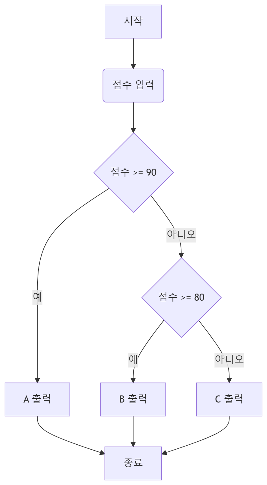

# Python 프로젝트 준비 (4차시)

---

## 프로젝트의 본질

프로젝트는 코드를 작성하는 활동이 아니라  
문제를 정의하고 해결하는 과정이다.

이번 시간에는  
문제를 어떻게 구조화하고, AI를 어떻게 활용하며,  
프로그램을 어떤 방식으로 설계해야 하는지 학습한다.

---

## 프로젝트 진행 구조

프로젝트는 다음과 같은 흐름으로 진행된다.

문제 정의 → 설계 → 구현 → 검증 → 개선

이 중에서 가장 중요한 단계는 설계이다.  
설계 없이 코드를 작성하면 구조가 무너지고,  
결과를 설명하기 어려워진다.

---

## 좋은 주제의 조건

좋은 프로젝트는 다음 질문에 답할 수 있어야 한다.

- 어떤 값을 입력받는가  
- 어떤 결과를 출력하는가  
- 어떤 기준으로 결과가 달라지는가  

또한 결과에 대해  
“왜 이런 결과가 나왔는지” 설명할 수 있어야 한다.

---

## 프로젝트 방향

이번 프로젝트는 사회 복지 문제를 기반으로 한다.

복잡한 시스템을 만드는 것이 아니라  
입력값을 바탕으로 상태를 판단하는 프로그램을 만든다.

예를 들어:

- 소득이 낮고 건강 상태가 나쁘면 → 지원 필요  
- 생활 패턴이 불규칙하면 → 위험 상태  

이처럼 조건을 기반으로 결과를 도출하는 구조이다.

---

## 플로우차트

코드를 작성하기 전에  
프로그램의 흐름을 먼저 정리해야 한다.

플로우차트는 코드의 설계도 역할을 한다.

---

### 예시 문제: 점수에 따른 등급 출력

아래는 해당 문제의 흐름을 나타낸 것이다.



---

### 코드 변환

```python
score = int(input("점수: "))

if score >= 90:
    print("A")
elif score >= 80:
    print("B")
else:
    print("C")
```

플로우차트와 코드가 같은 구조라는 점이 중요하다.

---

## AI 활용 원칙

AI는 코드를 빠르게 생성하는 도구이다.  
하지만 그대로 사용하는 것은 의미가 없다.

반드시 다음 과정을 거쳐야 한다.

- 코드 생성  
- 코드 이해  
- 코드 수정  
- 결과 검증  

---

## AI 코드 생성 템플릿

다음 형식을 사용하여 질문한다.

---

목표:  
무엇을 만들고 싶은지 구체적으로 작성

입력:  
어떤 값을 입력받는지

출력:  
어떤 결과를 출력할지

조건:  
판단 기준과 규칙

요청:  
- 파이썬 코드로 작성  
- 각 줄에 대한 설명 포함  

---

### 예시

목표:  
소득에 따라 점수를 계산하는 함수 작성

입력:  
income (정수)

출력:  
점수 (정수)

조건:  
직접 정의

요청:  
함수 형태로 작성하고 설명 포함

---

## 프로그램 구조

프로그램은 여러 개의 함수로 나누어 작성한다.

```python
def function1():
    pass

def function2():
    pass

def function3():
    pass

def main():
    pass
```

각 기능을 나누어 구현한 뒤  
main 함수에서 전체를 연결한다.

---

## 구현 규칙

반드시 다음 규칙을 지킨다.

- 함수는 하나의 기능만 수행  
- 입력값과 출력값을 명확히 정의  
- 함수 이름은 역할이 드러나도록 작성  

---

## 미니 프로젝트

https://colab.research.google.com/drive/1F2bACRaBa5PaMcLYLursSgHcALRo18DG?usp=sharing

### 복지 대상자 지원 판단 프로그램

사회 복지 상황을 단순화하여  
조건에 따라 지원 필요 여부를 판단하는 프로그램을 만든다.

---

### 입력

- 소득 (정수)  
- 건강 상태 (1~3)  
- 가족 수 (정수)  

---

### 출력

- 지원 등급 (A / B / C)

---

### 판단 기준

판단 기준은 스스로 설계한다.  

단, 다음 조건을 만족해야 한다.

- 입력값에 따라 결과가 달라질 것  
- 기준이 명확할 것  
- 결과를 설명할 수 있을 것  

---

### 구현 구조

다음 함수 구조를 반드시 사용한다.

```python
def check_income(income):
    return score

def check_health(health):
    return score

def check_family(family):
    return score

def calculate_total(s1, s2, s3):
    return total

def print_result(total):
    pass
```

---

### 필수 조건

- 함수 4개 이상 사용  
- 사용자 입력 사용  
- 결과 출력 필수  
- AI 사용 가능  
- 코드 일부 직접 수정  

---

### 진행 순서

1. 플로우차트 작성  
2. 판단 기준 설계  
3. 함수 구조 작성  
4. AI로 코드 생성  
5. 코드 분석  
6. 코드 수정  
7. 실행 및 검증  

---

## 핵심 정리

- 설계 없이 코드를 작성하지 않는다  
- 플로우차트는 코드의 구조이다  
- AI는 도구이며 이해가 필수이다  
- 프로그램은 함수로 나누어 작성한다  
- 결과는 반드시 설명할 수 있어야 한다  

이 과정을 통해  
단순한 코드 작성이 아니라  
문제 해결 능력을 기르는 것이 목표이다.
